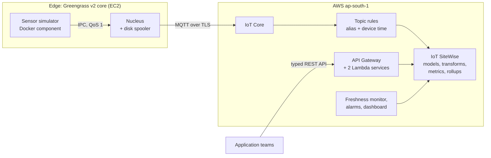
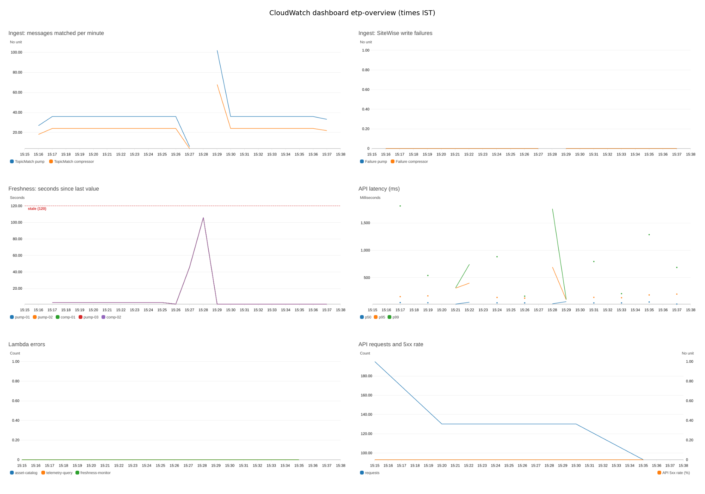
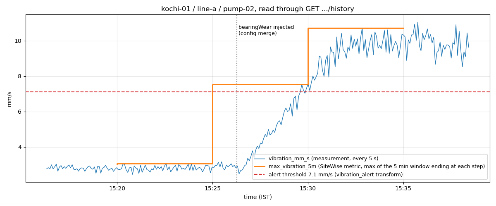

# Edge-to-Cloud Telemetry Platform

[](https://github.com/HashirAKB/edge-telemetry-platform/actions/workflows/ci.yml)

Application teams should not need to know MQTT topics, device certificates, or SiteWise property IDs. This platform owns ingestion, modeling, and rollups for industrial telemetry, and exposes a stable, typed, versioned API over the asset hierarchy. A Greengrass v2 edge device runs a containerized sensor simulator and buffers through network outages. AWS IoT Core rules route every measurement into AWS IoT SiteWise asset models, which compute transforms and windowed rollups across a site, its lines, and its machines. TypeScript Lambda services expose the result as a typed REST API. All of it is defined in AWS CDK from one topology file.

**Status:** reference build, MVP complete, deployed and verified end to end in `ap-south-1`. The sensors are simulated; everything from the Greengrass core onwards is real AWS. The stretch goals (local Grafana, a typed client, Stream Manager ingest, cold tier, a second site) are not built. See [what is verified and what is not](docs/TRACEABILITY.md).

## Architecture



One file, [`packages/shared/src/topology.ts`](packages/shared/src/topology.ts), lists the site (`kochi-01`), its two lines, and five machines. From it the build derives the SiteWise assets, property aliases, MQTT topics, IoT rule templates, simulator devices, and the plant keys the API accepts (`kochi-01/line-a/pump-01`). Adding a machine is a one-line change.

More detail: [architecture and sequence diagrams](docs/architecture.md) (ingest, outage replay, API query, alerting) and the [architecture decision records](docs/adr/README.md).

## What is real and what is simulated

| Real (deployed and tested in AWS)                                                                 | Simulated or simplified                                                    |
| ------------------------------------------------------------------------------------------------- | -------------------------------------------------------------------------- |
| A Greengrass v2 core device on EC2 with nucleus, disk spooler, Docker, and token exchange service | Sensors: a TypeScript simulator with drift, noise, load cycles, and faults |
| MQTT over TLS with X.509 certificates and least-privilege IoT policies                            | One site, two lines, five machines                                         |
| IoT Core rules writing to SiteWise by property alias with device timestamps                       | No OPC UA, PLCs, or plant network                                          |
| SiteWise models, assets, transforms, windowed metrics, and line rollups                           | API keys instead of per-user identity (ADR 0008)                           |
| The query API, alarms with email, a cost budget, CI with secret scanning                          | The EC2 host stands in for an on-premises gateway                          |

## Screenshots

The CloudWatch dashboard `etp-overview` during a live session on 2026-10-09. At 15:27 IST outbound MQTT on the core was blocked for 2 minutes: ingest drops to zero, freshness climbs to about 105 seconds (under the 120 second stale line), and on reconnect the disk spooler replays the backlog (the spike to about 100 messages a minute). SiteWise then held every point (37 for 36 intervals). The p99 spikes in API latency are Lambda cold starts at this low request rate:



pump-02 vibration read back through the query API's history endpoint. A bearing-wear fault was injected at 15:26 IST with a Greengrass configuration merge (no image rebuild). Vibration ramps past the 7.1 mm/s alert threshold, and SiteWise's 5-minute maximum follows it window by window:



## Quickstart: local, no AWS account

Needs Node.js 24 (`.nvmrc`) and pnpm 12 (`corepack enable`). Docker is optional.

```bash
pnpm install
pnpm build && pnpm test          # all packages; no AWS credentials needed
pnpm sim:local                   # prints telemetry for 5 machines as JSON lines
pnpm synth                       # synthesizes every CloudFormation template
docker build -f packages/simulator/Dockerfile -t etp-simulator .   # the edge image
```

## Quickstart: deploy to AWS

Needs an AWS account, the AWS CLI v2 with a named profile, and Docker. Every command takes the profile explicitly, and the region is pinned to `ap-south-1` (`-c region=...` to change it). The alert email is passed on the command line and never committed. Running cost is about 5 cents an hour while the edge runs; see [cost](docs/cost.md).

```bash
export AWS_PROFILE=<profile>
EMAIL=<your alert email>
ACCOUNT=$(aws sts get-caller-identity --query Account --output text)
TAG=$(git rev-parse --short HEAD)          # the image tag pnpm edge:publish-image will use

# 1. One-time CDK bootstrap for the account and region.
pnpm -F @etp/infra exec cdk bootstrap aws://$ACCOUNT/ap-south-1 --profile $AWS_PROFILE

# 2. Cloud platform: ECR, SNS, SiteWise models and assets, IoT rules, API, alarms, budget.
pnpm -F @etp/infra exec cdk deploy EtpFoundation EtpSiteWise EtpIngest EtpApi EtpObservability \
  --profile $AWS_PROFILE -c simulatorImageTag=$TAG -c alertEmail=$EMAIL
#    Confirm the SNS subscription from the email AWS sends.

# 3. Edge: push the simulator image, then the Greengrass deployment and the EC2 core host.
pnpm edge:publish-image                     # prints the tag; it must match $TAG
pnpm -F @etp/infra exec cdk deploy EtpEdge EtpEdgeHost --profile $AWS_PROFILE \
  -c edgeHost=ec2 -c simulatorImageTag=$TAG -c alertEmail=$EMAIL

# 4. Verify (the core takes 3 to 5 minutes to install and start).
pnpm edge:status                            # core HEALTHY, component RUNNING
pnpm check:ingest                           # every SiteWise property fresh
pnpm monitor:on                             # freshness monitor, once data is flowing
pnpm smoke                                  # 16 end-to-end checks; aggregates need 10+ minutes of data
```

In zsh, a `-c` option stored in a variable does not word-split. Write the options out as above. The CDK app refuses to synthesize with credentials but no image tag, rather than deploy a component that points at a missing image. If `t2.micro` has no capacity in the default zone, add `-c edgeAz=ap-south-1c`. The [runbook](docs/runbook.md) covers the edge, monitoring, and troubleshooting.

## Query API

Application teams read telemetry through a typed REST API and never deal with MQTT topics, device certificates, or SiteWise property IDs. The full contract is in [`docs/openapi.yaml`](docs/openapi.yaml), generated from the same zod schemas the Lambda handlers validate with.

| Method and path                                               | Returns                                                                      |
| ------------------------------------------------------------- | ---------------------------------------------------------------------------- |
| `GET /v1/health`                                              | Build version and SiteWise reachability (no API key)                         |
| `GET /v1/assets/tree`                                         | Site, lines, and machines with every property (kind, unit, data type, alias) |
| `GET /v1/assets/{assetId}`                                    | One asset with its parent and children                                       |
| `GET /v1/assets/by-key/{siteId}/{lineId}/{machineId}`         | Resolve plant IDs such as `kochi-01/line-a/pump-01` to an asset              |
| `GET /v1/assets/{assetId}/latest`                             | Latest value of every property, plus a `stale` flag                          |
| `GET /v1/assets/{assetId}/properties/{propertyId}/history`    | Raw values, up to 24 h per request, paginated                                |
| `GET /v1/assets/{assetId}/properties/{propertyId}/aggregates` | Averages, min, max, and more at `1m`, `15m`, `1h`, or `1d`                   |

Errors use RFC 7807 `application/problem+json`. Every route except health needs the `x-api-key` header; the usage plan allows 10 requests per second and 10,000 per day.

```bash
# After deploying the stacks, read the URL and key (the key value is never in stack outputs):
export AWS_PROFILE=<your-profile>
API=$(aws cloudformation describe-stacks --stack-name EtpApi \
  --query "Stacks[0].Outputs[?OutputKey=='ApiUrl'].OutputValue" --output text)
KEY_ID=$(aws cloudformation describe-stacks --stack-name EtpApi \
  --query "Stacks[0].Outputs[?OutputKey=='ApiKeyId'].OutputValue" --output text)
KEY=$(aws apigateway get-api-key --api-key "$KEY_ID" --include-value --query value --output text)

curl -s "${API}v1/health"
curl -s -H "x-api-key: $KEY" "${API}v1/assets/tree"

PUMP=$(curl -s -H "x-api-key: $KEY" "${API}v1/assets/by-key/kochi-01/line-a/pump-01" | jq -r .assetId)
curl -s -H "x-api-key: $KEY" "${API}v1/assets/$PUMP/latest"

TEMP=$(curl -s -H "x-api-key: $KEY" "${API}v1/assets/$PUMP" | jq -r '.properties[] | select(.name=="temperature_c") | .propertyId')
FROM=$(date -u -d '-30 min' +%Y-%m-%dT%H:%M:%SZ); TO=$(date -u +%Y-%m-%dT%H:%M:%SZ)
curl -s -H "x-api-key: $KEY" \
  "${API}v1/assets/$PUMP/properties/$TEMP/aggregates?from=$FROM&to=$TO&resolution=1m&types=AVERAGE,MAXIMUM"
```

`pnpm smoke` runs these checks end to end, plus error cases and latency percentiles. Measured p95: tree 59 ms (warm), latest 156 ms, 24 hours of 1-minute aggregates 81 ms.

## Demos

| Command                                   | Shows                                                                                        |
| ----------------------------------------- | -------------------------------------------------------------------------------------------- |
| `pnpm edge:outage-test`                   | Blocks MQTT on the core for 2 minutes, then proves zero loss in SiteWise (36 of 36 points)   |
| `pnpm edge:outage-test --restart`         | The same, with a Greengrass restart during the outage (the spool survives on disk)           |
| `pnpm edge:fault bearingWear pump-02 600` | A live fault through a deployment config merge: vibration rises, status FAULT, rollups react |
| `pnpm edge:fault clear`                   | Ends the fault                                                                               |

[`docs/DEMO.md`](docs/DEMO.md) is a 5-minute screen-share script.

## Cost and teardown

About **5 cents an hour** while the edge runs (EC2 `t2.micro`, IoT Core, SiteWise ingestion at 5 machines x 1 message every 5 seconds) and about **USD 1.60 a month idle** (alarms). An AWS Budgets budget in CDK emails at 50, 80, and 100 percent of USD 10 a month. The platform is designed to run on demand: 24/7 at the default rate would cost about USD 38 a month. Details in [`docs/cost.md`](docs/cost.md).

Stop the expensive part after a demo, keeping the rest deployed:

```bash
pnpm monitor:off
pnpm -F @etp/infra exec cdk destroy EtpEdgeHost --force --profile $AWS_PROFILE \
  -c edgeHost=ec2 -c simulatorImageTag=$TAG -c alertEmail=$EMAIL
pnpm edge:deprovision      # the core's thing and certificate, created on the instance
```

Remove everything:

```bash
pnpm teardown --dry-run    # the plan, and every project resource that exists now
pnpm teardown              # type the account ID to confirm; deletes in dependency order
```

Teardown deletes the stacks in dependency order: alarms first, so nothing pages while the edge goes away, then the edge, the API, ingest, SiteWise, and foundation. It also removes the core's installer-created certificate and the log groups that CDK's own helper Lambdas leave behind, and then lists anything that remains. The CDK bootstrap stack and any budgets you created by hand are left in place on purpose; the script names them.

## Tech stack

| Area             | Choice                                                                                                         |
| ---------------- | -------------------------------------------------------------------------------------------------------------- |
| Language         | TypeScript 6 (strict), Node.js 24, pnpm workspaces                                                             |
| Edge             | AWS IoT Greengrass v2 (nucleus 2.18.3, DiskSpooler, Docker application manager), Docker, AWS IoT Device SDK v2 |
| Ingest and model | AWS IoT Core (MQTT, topic rules), AWS IoT SiteWise                                                             |
| API              | Amazon API Gateway (REST), AWS Lambda (Node.js 24, ARM64), zod, OpenAPI 3.1                                    |
| Observability    | Powertools for AWS Lambda (logs, EMF metrics, X-Ray), CloudWatch dashboards and alarms, SNS, AWS Budgets       |
| Infrastructure   | AWS CDK v2 (7 stacks), EventBridge Scheduler, ECR, EC2 with SSM                                                |
| Quality          | Vitest with coverage thresholds, ESLint (strict, type-checked), Prettier, GitHub Actions, gitleaks             |

## Repository layout

```
packages/shared      topology, measurements, topics and aliases, message contract, API schemas
packages/simulator   sensor simulator: signals, faults, publisher, transports (stdout, mqtt, ipc), Dockerfile
packages/api         Lambda handlers, services, SiteWise reader, freshness monitor
packages/infra       CDK app and stacks, assertion tests
scripts              device, edge, smoke, outage, fault, monitoring, and teardown scripts
docs                 SRS, architecture, ADRs, runbook, cost, demo script, interview notes, traceability
```

## Documentation

- [Architecture](docs/architecture.md) and [ADRs](docs/adr/README.md)
- [Runbook](docs/runbook.md), [cost](docs/cost.md), [demo script](docs/DEMO.md)
- [Traceability](docs/TRACEABILITY.md): each claim and the evidence for it
- [Interview notes](docs/INTERVIEW_NOTES.md)
- [Specification](docs/SRS.md)

## License

[MIT](LICENSE)
