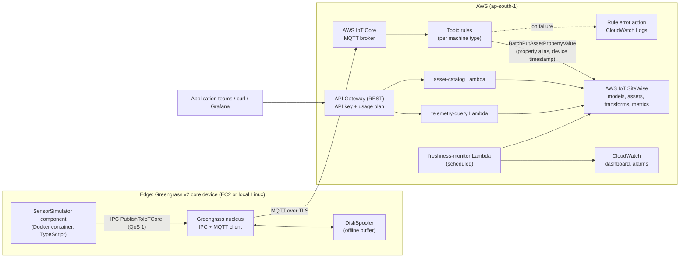

# Edge-to-Cloud Telemetry Platform
## Software Requirements Specification and Build Brief for a Claude Code Session

Owner: Hashir Ahmed K B (GitHub: `HashirAKB`)
Repository to create: `github.com/HashirAKB/edge-telemetry-platform`
Version: 1.0 (2026-10-07)
Target completion: working, deployed, documented within 2 to 3 working days

---

## 0. READ THIS FIRST: how you (the coding agent) must work

You are building a real, deployable reference platform on AWS for Hashir. Read this whole document before doing anything. Then follow these rules for the entire session.

### 0.1 First action: create the GitHub repo (Phase 0) and report the URL

Before any planning or code, do exactly this and nothing else:

1. Run `gh auth status`. If not authenticated, stop and ask Hashir to run `gh auth login` himself (do not handle his token).
2. Run `gh repo view HashirAKB/edge-telemetry-platform`. If it already exists, stop and ask Hashir whether to reuse it. Do not delete or overwrite anything.
3. Create a local folder `edge-telemetry-platform`, `git init -b main`, and add only:
   - `README.md` stub (see 0.4 for the exact wording rule)
   - `LICENSE` (MIT, copyright "Hashir Ahmed K B")
   - `.gitignore` (Node, CDK `cdk.out/`, `.env*`, `.certs/`, `*.pem`, `*.key`, `*.crt`, `coverage/`, `dist/`)
   - `docs/SRS.md` (this document, verbatim)
4. Make sure git uses Hashir's identity (`git config user.name` / `user.email`); if unset, ask him.
5. Commit: `chore: initialize repository with SRS`.
6. Create and push:
   ```bash
   gh repo create HashirAKB/edge-telemetry-platform --public \
     --description "Edge-to-cloud industrial telemetry platform on AWS: Greengrass v2 edge, IoT Core rules, IoT SiteWise asset models, TypeScript Lambda query API, AWS CDK" \
     --source . --remote origin --push
   gh repo edit HashirAKB/edge-telemetry-platform --add-topic aws-iot,aws-iot-greengrass,aws-iot-sitewise,aws-cdk,typescript,aws-lambda,iot,telemetry,edge-computing
   ```
7. Print the repo URL to Hashir in a short message on its own line so he can copy it. Then continue to Phase 1 planning.

### 0.2 Hashir's standing working rule (mandatory)

For any change that touches more than one file, write the plan and wait for Hashir's approval before editing. Single-file edits can proceed directly. In practice: at the start of each phase in Section 12, post the phase plan (files to create/change, key decisions, commands you will run, anything that costs money) and wait for "go". Then execute the whole phase, run its checks, commit, and report.

### 0.3 Other rules

- **Verify against current AWS docs, not memory.** AWS IoT services change. Before writing CDK for SiteWise, IoT rules, or Greengrass, check the current CloudFormation resource reference and service docs. Where this SRS and current docs disagree, follow the docs and note the difference in `docs/adr/`.
- **Never handle or print secrets.** Never commit credentials, private keys, or certificates. Never put secrets in CloudFormation outputs.
- **Ask before anything that costs money or is irreversible:** `cdk deploy`, creating EC2 instances, Managed Grafana workspaces, deleting stacks, force-pushing. State the expected cost when you ask.
- **Region:** `ap-south-1` (Mumbai) unless Hashir says otherwise.
- **Commits:** small, meaningful, Conventional Commits (`feat(api): ...`, `feat(infra): ...`, `test: ...`, `docs: ...`). One or more commits per phase, pushed at the end of each phase. No giant single commit.
- **No em dash characters** in any docs or README text Hashir will show people.
- **Teach as you go.** Hashir must be able to explain every part of this system in an interview. After each phase, add 3 to 6 Q&A entries to `docs/INTERVIEW_NOTES.md` covering what was built, why, the trade-offs, and what would change at production scale. Keep explanations plain and accurate.
- **Honesty in the README.** This is a reference build with simulated sensors. Say so plainly. Do not describe it as a production system or claim users, customers, or scale it does not have.

### 0.4 README stub wording for Phase 0

```markdown
# Edge-to-Cloud Telemetry Platform

Reference platform for industrial telemetry on AWS: a Greengrass v2 edge device runs a containerized sensor simulator,
AWS IoT Core rules route measurements into AWS IoT SiteWise asset models, and TypeScript Lambda services expose a
typed query API for application teams. Infrastructure is defined in AWS CDK.

Status: in active development. See docs/SRS.md for the full specification.
```

---

## 1. Context

### 1.1 Why this project exists

Hashir is a backend and platform engineer (5+ years, TypeScript/Node.js, AWS, Docker, microservices) applying for a **Product Platform Engineer** role at Experion Technologies (Kochi). The role builds platform APIs, reusable services, and data planes for telemetry-driven, cloud-native products, at the intersection of IoT integration and application development. It specifically names **AWS IoT SiteWise, AWS IoT Greengrass, edge-to-cloud architectures, Lambda, TypeScript, Docker, and microservices**.

Hashir's commercial experience covers the platform and backend side strongly but not AWS IoT. This project closes that gap with real, hands-on work he can demo and defend in a technical interview. The interview drive runs 8 to 15 October 2026, so the build must be scoped to finish fast without cutting the parts that matter.

### 1.2 What "done" must prove (resume traceability)

Hashir's resume describes this project with the claims below. Every claim must be true of the finished repo. Section 15 maps each claim to requirements and acceptance tests.

| # | Resume claim |
|---|---|
| C1 | A Greengrass v2 core device runs a containerized (Docker) component that simulates industrial sensors and publishes telemetry over MQTT, with buffering for intermittent connectivity. |
| C2 | AWS IoT Core rules route measurements into AWS IoT SiteWise asset models, with transforms and windowed metrics (rollups) across an equipment hierarchy. |
| C3 | TypeScript Lambda microservices behind API Gateway expose a typed telemetry query API (latest values, aggregates, asset tree), so application teams consume telemetry without touching IoT plumbing. |
| C4 | All infrastructure is defined in AWS CDK, with CI via GitHub Actions. |
| C5 | Stack: TypeScript, AWS CDK, AWS IoT Greengrass v2, AWS IoT Core, AWS IoT SiteWise, AWS Lambda, API Gateway, Docker. |

### 1.3 The platform story to tell

"Application teams should not need to know MQTT topics, device certificates, or SiteWise property IDs. The platform owns ingestion, modeling, and rollups, and exposes a stable, typed, versioned API over the asset hierarchy." Every design choice should support that sentence.

---

## 2. Scope

### 2.1 In scope (MVP, all required)

1. Monorepo (pnpm workspaces, TypeScript strict) with shared types and a single source of truth for plant topology.
2. Sensor simulator (TypeScript/Node.js) with realistic signals and fault injection, packaged as a Docker image.
3. Greengrass v2 core device (EC2 by default, local Linux/WSL2 optional) running the simulator as a Docker component that publishes to IoT Core through Greengrass IPC, with disk-backed offline buffering.
4. AWS IoT Core topic rules that write measurements into SiteWise via the SiteWise rule action, using property aliases and device timestamps, with an error action.
5. AWS IoT SiteWise asset models (Site, Line, Pump, Compressor) with measurements, transforms, metrics, and a hierarchy, plus asset instances generated from the topology config.
6. Query API: API Gateway (REST) plus TypeScript Lambda services for asset tree, latest values, raw history, and aggregates.
7. Observability: structured logs, metrics, tracing, CloudWatch dashboard, alarms, data-freshness monitor, cost budget alarm.
8. CI on GitHub Actions: lint, typecheck, unit tests, CDK synth and assertions, secret scanning.
9. Documentation: README with architecture diagram, runbook, ADRs, OpenAPI spec, cost notes, interview notes, demo script.

### 2.2 Stretch (only after MVP is deployed and verified)

- S1: Local Grafana (Docker Compose) with the AWS IoT SiteWise data source plugin, provisioned dashboard. (Do not use SiteWise Monitor: AWS has placed it in maintenance mode and it is not available to new customers. Amazon Managed Grafana costs money per user, so prefer local Grafana.)
- S2: Typed TypeScript client package for the API (generated or hand-written from shared schemas).
- S3: Greengrass Stream Manager export path to SiteWise as an alternative ingestion route, documented as an ADR comparing it with the IoT Core rule route.
- S4: SiteWise cold-tier storage to S3.
- S5: Second site or line added purely by editing topology config, to demonstrate the "platform scales by config" claim.

### 2.3 Out of scope

Real hardware, OPC UA, SiteWise Edge gateway, multi-tenant auth, Cognito user pools, frontend app beyond the optional Grafana, multi-region.

---

## 3. Architecture

### 3.1 Overview



### 3.2 Key design decisions (write each as an ADR in `docs/adr/`)

| ADR | Decision | Why |
|---|---|---|
| 0001 | Single topology config in `packages/shared` drives CDK assets, property aliases, simulator devices, and topic names | One source of truth; adding a machine is a config change, not code across layers |
| 0002 | Ingest via IoT Core rule with SiteWise action (not direct SDK calls from edge, not Stream Manager) | Edge stays protocol-simple (MQTT only); routing and mapping live in the cloud platform; rule errors are observable centrally. Stream Manager export noted as alternative (S3) |
| 0003 | Address SiteWise properties by **property alias** built from topic segments | Devices never need SiteWise IDs; aliases are stable and human-readable |
| 0004 | Use **device timestamps** from the payload, not ingest time | Buffered data replayed after an outage lands at the correct time. SiteWise accepts timestamps up to 7 days in the past and 5 minutes in the future, which bounds the offline window |
| 0005 | Offline buffering via Greengrass DiskSpooler plus QoS 1 | Survives network loss and core restarts without custom persistence code |
| 0006 | Simulator as a Docker component using Greengrass IPC from inside the container | Matches how containerized edge workloads are deployed; documents the socket and SVCUID wiring |
| 0007 | Query API as separate Lambda services (asset-catalog, telemetry-query) with least-privilege roles | Independent scaling, deploys, and blast radius; reads only |
| 0008 | REST API with API keys and a usage plan for auth and throttling | Simplest real auth for a reference build; documents that production would use IAM/JWT |
| 0009 | Grafana (local) instead of SiteWise Monitor | Monitor is closed to new customers |

---

## 4. Domain model and topology

### 4.1 Topology (single source of truth)

File: `packages/shared/src/topology.ts`. Exported as typed constants, consumed by infra and simulator.

```ts
export const topology = {
  site: { id: 'kochi-01', name: 'Kochi Plant 01' },
  lines: [
    {
      id: 'line-a', name: 'Line A',
      machines: [
        { id: 'pump-01', type: 'pump' },
        { id: 'pump-02', type: 'pump' },
        { id: 'comp-01', type: 'compressor' },
      ],
    },
    {
      id: 'line-b', name: 'Line B',
      machines: [
        { id: 'pump-03', type: 'pump' },
        { id: 'comp-02', type: 'compressor' },
      ],
    },
  ],
} as const;
```

Validate the topology with zod at module load (unique IDs, allowed characters for aliases and topics: `[a-z0-9-]`).

### 4.2 Measurements per machine type

| Type | Measurement | Unit | SiteWise data type |
|---|---|---|---|
| pump | temperature_c | Celsius | DOUBLE |
| pump | vibration_mm_s | mm/s | DOUBLE |
| pump | pressure_bar | bar | DOUBLE |
| pump | flow_lpm | L/min | DOUBLE |
| pump | status | enum RUNNING, IDLE, FAULT | STRING |
| compressor | temperature_c | Celsius | DOUBLE |
| compressor | vibration_mm_s | mm/s | DOUBLE |
| compressor | discharge_pressure_bar | bar | DOUBLE |
| compressor | motor_current_a | A | DOUBLE |
| compressor | status | enum | STRING |

Define these in `packages/shared/src/measurements.ts` as typed descriptors (name, unit, dataType, simulator signal profile) so infra and simulator share them.

### 4.3 SiteWise asset models

Verify every expression function and window syntax against current SiteWise docs before writing it.

**Pump model**
- Measurements: as in 4.2.
- Transforms:
  - `temperature_f = temperature_c * 9 / 5 + 32`
  - `vibration_alert = if(gt(vibration_mm_s, 7.1), 1, 0)` (7.1 mm/s chosen as an illustrative vibration severity threshold; document it as illustrative)
- Metrics (tumbling windows):
  - `avg_temperature_1m = avg(temperature_c)` every 1m
  - `max_vibration_5m = max(vibration_mm_s)` every 5m
  - `alert_minutes_5m = sum(vibration_alert)` every 5m (or equivalent supported construct)

**Compressor model**
- Measurements: as in 4.2.
- Transforms: `temperature_f`, `vibration_alert` (same as pump).
- Metrics: `avg_temperature_1m`, `max_discharge_pressure_5m`, `avg_motor_current_5m`.

**Line model**
- Hierarchies: `pumps` (child model Pump), `compressors` (child model Compressor).
- Metrics rolled up from children (this proves "rollups across an equipment hierarchy"):
  - `line_avg_pump_temperature_5m`: average across child pumps' `avg_temperature_1m` (or `temperature_c`), using a hierarchy-scoped variable.
  - `line_max_vibration_5m`: max across child pumps.

**Site model**
- Hierarchy: `lines` (child model Line).
- Metric: `site_max_line_vibration_5m` from child lines.
- Attribute: `timezone` = `Asia/Kolkata` (attributes demonstrate static metadata).

### 4.4 Property aliases

Each machine measurement gets an alias:

```
/{siteId}/{lineId}/{machineId}/{measurement}
e.g. /kochi-01/line-a/pump-01/temperature_c
```

Build aliases with a shared helper `aliasFor(site, line, machine, measurement)` used by both infra (to set `Alias` on asset properties) and tests.

---

## 5. Message contract (edge to cloud)

### 5.1 Topic

```
telemetry/v1/{siteId}/{lineId}/{machineType}/{machineId}
```

Positions for IoT SQL `topic(n)`: 1 `telemetry`, 2 `v1`, 3 site, 4 line, 5 type, 6 machine.

### 5.2 Payload (JSON, schema version 1)

```json
{
  "v": 1,
  "ts": 1791375084123,
  "seq": 48211,
  "machineId": "pump-01",
  "metrics": {
    "temperature_c": 61.42,
    "vibration_mm_s": 3.18,
    "pressure_bar": 4.95,
    "flow_lpm": 212.7
  },
  "status": "RUNNING"
}
```

- `ts`: device epoch milliseconds at sample time (required).
- `seq`: monotonic per machine since process start (used to detect gaps in tests and logs).
- Defined as a zod schema `TelemetryMessageV1` in `packages/shared`. The simulator validates every message before publishing.
- Size target: under 1 KB.

### 5.3 Contract evolution

The `v1` topic segment and `v` field allow a future `v2` rule to run alongside `v1`. Document in ADR 0003.

---

## 6. Functional requirements

IDs are referenced by tests and the traceability table.

### 6.1 Simulator (`packages/simulator`)

- **FR-SIM-1** Generates one message per configured machine every `intervalMs` (default 5000).
- **FR-SIM-2** Signals are realistic and deterministic under a seed: base value, slow drift, daily sine component, Gaussian noise, and correlation (vibration rises with load; temperature lags load).
- **FR-SIM-3** Fault injection via config: `bearingWear` (vibration ramps up over N minutes), `overheat` (temperature step plus slow rise), `stuckSensor` (value freezes), `dropout` (machine stops publishing for N seconds). Faults are scheduled by start offset and duration.
- **FR-SIM-4** Status derived from signals: FAULT when a fault is active and its threshold is crossed, IDLE on scheduled idle windows, RUNNING otherwise.
- **FR-SIM-5** Transports, selected by `TRANSPORT` env: `ipc` (Greengrass IPC `PublishToIoTCore`, QoS 1; the production path), `mqtt` (direct to IoT Core with a dev certificate, for local development only), `stdout` (prints JSON; for tests and demos without AWS).
- **FR-SIM-6** Configuration source: Greengrass component configuration when running as a component (read via IPC `GetConfiguration` and subscribe to updates so a deployment config merge changes interval or faults live), environment and a JSON file otherwise. Validate with zod.
- **FR-SIM-7** App-level bounded buffer: if the IPC publish call fails (nucleus restarting), queue up to `bufferMax` messages in memory (drop-oldest), retry with exponential backoff and jitter, and log counts. The DiskSpooler handles the network-offline case; this buffer handles local IPC failures.
- **FR-SIM-8** Graceful shutdown on SIGTERM: flush buffer best-effort within 5 s, then exit 0.
- **FR-SIM-9** Structured JSON logs to stdout (Greengrass captures them to the component log).
- **FR-SIM-10** Docker image: multi-stage build, `node:24-slim` (Debian; avoid Alpine because the AWS CRT native modules used by `aws-iot-device-sdk-v2` expect glibc), non-root user, production deps only, image under 250 MB.

### 6.2 Edge (Greengrass)

- **FR-EDGE-1** A Greengrass v2 core device installed with the current nucleus release, joined to thing group `etp-edge-cores`.
- **FR-EDGE-2** Components deployed to the thing group: `aws.greengrass.Nucleus` (with MQTT spooler configured to use disk), `aws.greengrass.DiskSpooler`, `aws.greengrass.DockerApplicationManager`, `aws.greengrass.TokenExchangeService`, and the custom `com.hashirakb.etp.SensorSimulator`.
- **FR-EDGE-3** The simulator component recipe pulls its image from a private ECR repository created by CDK, runs it with Greengrass IPC wired into the container (domain socket mount and `SVCUID`, `AWS_GG_NUCLEUS_DOMAIN_SOCKET_FILEPATH_FOR_COMPONENT` env vars, exactly as the current "IPC in Docker container components" docs specify), and declares `accessControl` for `aws.greengrass.ipc.mqttproxy` allowing publish only to `telemetry/v1/#`.
- **FR-EDGE-4** Component configuration (devices from topology, interval, faults, buffer size) is set via the deployment's default configuration and can be changed by a configuration merge without rebuilding the image.
- **FR-EDGE-5** Offline buffering: with outbound network blocked for 2 minutes, no messages are lost and, after reconnect, all buffered messages reach SiteWise with their original timestamps. QoS 1 publishes; spooler sized for at least 30 minutes of traffic.
- **FR-EDGE-6** Core host default: EC2 (Amazon Linux 2023 or Ubuntu 24.04 LTS, `t3.small`), created by an optional CDK stack, no inbound ports, access via SSM Session Manager, user data installs Java (Corretto), Docker, and Greengrass with automatic provisioning using the documented minimal installer permissions. Alternative: a runbook section for installing on Hashir's own Linux or WSL2 machine. Ask Hashir which host he wants before Phase 6.

### 6.3 Ingestion (IoT Core rules)

- **FR-ING-1** One topic rule per machine type: SQL `SELECT * FROM 'telemetry/v1/+/+/pump/+'` and the compressor equivalent. SQL version `2016-03-23`.
- **FR-ING-2** SiteWise action with one `putAssetPropertyValueEntries` entry per measurement plus status. `propertyAlias` built from topic segments, for example `/${topic(3)}/${topic(4)}/${topic(6)}/temperature_c`.
- **FR-ING-3** Timestamps from the payload: `timeInSeconds = ${floor(ts / 1E3)}`, `offsetInNanos = ${(ts % 1E3) * 1E6}`. Quality `GOOD`.
- **FR-ING-4** Numeric values as `doubleValue` from `${metrics.<name>}`; status as `stringValue`.
- **FR-ING-5** Rule role allows only `iotsitewise:BatchPutAssetPropertyValue`, scoped with the `iotsitewise:assetHierarchyPath` condition to the site root asset and its descendants.
- **FR-ING-6** Error action to a dedicated CloudWatch Logs group (`/etp/iot/rule-errors`, 14-day retention), with its own role.
- **FR-ING-7** Optional raw archive: a second action writing raw payloads to S3 under `raw/{site}/{line}/{machine}/{yyyy}/{mm}/{dd}/` with 7-day lifecycle expiry. Off by default via CDK context flag.

### 6.4 SiteWise

- **FR-SW-1** Asset models in 4.3 created by CDK (`AWS::IoTSiteWise::AssetModel`).
- **FR-SW-2** One asset per topology node (`AWS::IoTSiteWise::Asset`) with hierarchy associations and measurement aliases set from 4.4. Asset names include the topology ID.
- **FR-SW-3** Adding a machine to `topology.ts` and redeploying creates the asset, alias, and simulator device with no other code change (verified in S5 or by a CDK assertion test).
- **FR-SW-4** Notification state for properties left disabled (MQTT notifications not needed for MVP).

### 6.5 Query API

Base path `/v1`. All responses JSON. Errors use RFC 7807 `application/problem+json`.

| ID | Method and path | Service | Behavior |
|---|---|---|---|
| FR-API-1 | `GET /v1/assets/tree` | asset-catalog | Full hierarchy site, lines, machines with `assetId`, `externalKey` (topology ID), `type`, and properties (`propertyId`, `name`, `kind` measurement/transform/metric/attribute, `unit`, `dataType`, `alias`). Cached in Lambda memory for 5 minutes. |
| FR-API-2 | `GET /v1/assets/{assetId}` | asset-catalog | One asset with properties and children IDs. |
| FR-API-3 | `GET /v1/assets/by-key/{siteId}/{lineId}/{machineId}` | asset-catalog | Resolve topology key to asset (lets apps use human IDs). |
| FR-API-4 | `GET /v1/assets/{assetId}/latest` | telemetry-query | Latest value, timestamp, quality for every property, plus `stale: true` when older than 3 x the expected interval. Uses `BatchGetAssetPropertyValue` (respect per-call entry limits by chunking). |
| FR-API-5 | `GET /v1/assets/{assetId}/properties/{propertyId}/history?from&to&limit&nextToken` | telemetry-query | Raw values from `GetAssetPropertyValueHistory`. ISO-8601 `from`/`to`; max range 24 h; default limit 250, max 1000; opaque pagination token passthrough. |
| FR-API-6 | `GET /v1/assets/{assetId}/properties/{propertyId}/aggregates?from&to&resolution&types` | telemetry-query | `GetAssetPropertyAggregates`. `resolution` one of `1m`, `15m`, `1h`, `1d`; `types` subset of `AVERAGE,MINIMUM,MAXIMUM,COUNT,SUM,STANDARD_DEVIATION`; range guard per resolution (for example 1m max 24 h). |
| FR-API-7 | `GET /v1/health` | asset-catalog | No auth; returns build version and a cheap SiteWise reachability check. |

- **FR-API-8** Request and response schemas defined once with zod in `packages/shared/src/api/`, used for runtime validation in handlers and for generating `docs/openapi.yaml` (use `@asteasolutions/zod-to-openapi` or equivalent; check it is maintained before adopting). Export TypeScript types for consumers.
- **FR-API-9** Auth: API key required on all routes except health; usage plan throttling 10 rps, burst 20; daily quota 10,000.
- **FR-API-10** CORS enabled for `GET` from any origin (reference build; documented).
- **FR-API-11** Handlers are thin: parse and validate, call a service module, map to response. SiteWise access lives in a repository module with an injectable client for tests.

### 6.6 Observability and operations

- **FR-OBS-1** Lambdas use Powertools for AWS Lambda (TypeScript): Logger (JSON, correlation ID from API request ID), Metrics (EMF), Tracer (X-Ray active tracing).
- **FR-OBS-2** freshness-monitor Lambda runs every 1 minute (EventBridge Scheduler), reads latest `temperature_c` timestamp for every machine, publishes custom metric `SecondsSinceLastValue` with dimension `machineId`.
- **FR-OBS-3** Alarms: data stale (> 120 s for 3 of 3 periods, per machine), IoT rule action failures, Lambda errors > 0 for 5 minutes, API 5xx rate > 1 percent, simulator offline (all machines stale). Alarms notify an SNS topic; email subscription address passed as CDK context `alertEmail` (never hard-coded).
- **FR-OBS-4** CloudWatch dashboard `etp-overview`: ingest message rate, rule failures, API latency p50/p95/p99, Lambda errors, freshness per machine.
- **FR-OBS-5** AWS Budgets monthly cost budget, default USD 10, email alerts at 50, 80, 100 percent actual and 100 percent forecasted.

### 6.7 Developer experience

- **FR-DX-1** `pnpm install && pnpm build && pnpm test` works on a clean clone with no AWS credentials.
- **FR-DX-2** `pnpm sim:local` runs the simulator with `TRANSPORT=stdout`.
- **FR-DX-3** `scripts/provision-dev-device.ts` creates a dev IoT thing, keys, and certificate into `.certs/` (gitignored) for `TRANSPORT=mqtt`, and `scripts/deprovision-dev-device.ts` removes them.
- **FR-DX-4** `pnpm smoke` runs an end-to-end check against a deployed stack: tree has expected nodes, latest values are fresh, aggregates return data.
- **FR-DX-5** `pnpm teardown` documents and runs `cdk destroy` in the right order after confirmation, and lists anything left behind (for example ECR images, log groups with retention).

---

## 7. Non-functional requirements

| ID | Requirement |
|---|---|
| NFR-1 Latency | API p95 under 500 ms for tree (warm, cached) and latest; under 1.5 s for aggregates over 24 h at 1m resolution |
| NFR-2 Freshness | End-to-end device sample to SiteWise latest value under 10 s in normal operation |
| NFR-3 Durability | Zero message loss across a 2-minute network outage and across a Greengrass core restart (FR-EDGE-5) |
| NFR-4 Security | Least-privilege IAM per Lambda and per rule; IoT policies scoped to the thing and the `telemetry/v1/*` topic tree; no wildcard `iot:*`; no inbound ports on EC2; secrets never in repo or outputs; gitleaks in CI |
| NFR-5 Cost | Under USD 10 per month when running, near zero when the edge host is stopped; default publish rate 5 machines x 1 msg / 5 s. Document the main cost drivers in `docs/cost.md` from the current AWS pricing pages |
| NFR-6 Code quality | TypeScript `strict`, no `any` without a comment explaining why, ESLint (flat config) + Prettier clean, unit test coverage of 80 percent or more on `shared`, `simulator`, and `api` |
| NFR-7 Reproducibility | Lockfile committed; Node version pinned via `.nvmrc` / `engines`; CDK version pinned |
| NFR-8 Teardown | `cdk destroy` removes all billable resources; documented manual leftovers listed |

---

## 8. Technology choices

Use current stable versions at build time and pin them. Check each before adopting.

| Area | Choice |
|---|---|
| Language | TypeScript (strict), Node.js 24 LTS locally |
| Package manager | pnpm workspaces |
| Lambda runtime | `nodejs24.x` (do not use `nodejs26.x`, which is preview) |
| Lambda bundling | `aws-cdk-lib/aws-lambda-nodejs` `NodejsFunction` (esbuild), ARM64 |
| AWS SDK | v3 modular clients (`@aws-sdk/client-iotsitewise`, `@aws-sdk/client-iot`) |
| Validation | zod |
| Lambda utilities | Powertools for AWS Lambda (TypeScript) |
| IaC | AWS CDK v2 (TypeScript); L1 `Cfn*` constructs for SiteWise, IoT rules, Greengrass where no L2 exists |
| Edge SDK | `aws-iot-device-sdk-v2` (Greengrass IPC client and MQTT5 client) |
| Tests | Vitest; `aws-sdk-client-mock`; CDK `assertions` |
| CI | GitHub Actions |
| Container | Docker, multi-stage, `node:24-slim` |

---

## 9. Repository structure

```
edge-telemetry-platform/
├─ README.md
├─ LICENSE
├─ package.json                 # workspace scripts: build, test, lint, typecheck, sim:local, smoke, teardown
├─ pnpm-workspace.yaml
├─ tsconfig.base.json
├─ eslint.config.js
├─ .nvmrc
├─ .github/workflows/ci.yml
├─ docs/
│  ├─ SRS.md
│  ├─ architecture.md          # diagram, data flow, sequence diagrams (ingest, outage replay, API query)
│  ├─ runbook.md               # deploy, edge host setup (EC2 and local), demo, troubleshooting, teardown
│  ├─ cost.md
│  ├─ openapi.yaml             # generated
│  ├─ INTERVIEW_NOTES.md
│  ├─ DEMO.md                  # 5-minute live demo script
│  └─ adr/0001-...md ... 0009-...md
├─ packages/
│  ├─ shared/                  # topology, measurements, alias + topic builders, message schema, API schemas
│  ├─ simulator/               # signal models, faults, transports, config, Dockerfile
│  ├─ api/                     # lambda handlers, services, sitewise repository
│  └─ infra/                   # CDK app and stacks
└─ scripts/                    # provision/deprovision dev device, smoke test, teardown, openapi generation
```

---

## 10. Infrastructure (CDK stacks)

Stack prefix `Etp`. All stacks tagged `project=edge-telemetry-platform`, `owner=hashir`. Context flags: `alertEmail`, `budgetUsd` (default 10), `edgeHost` (`ec2` | `none`, default `none`), `rawArchive` (default false).

| Stack | Resources |
|---|---|
| `EtpFoundation` | ECR repository for the simulator image (scan on push, lifecycle keep last 5), SNS alerts topic, rule-errors log group |
| `EtpSiteWise` | Asset models (Site, Line, Pump, Compressor) and assets from topology, with aliases and hierarchy associations. Outputs root asset ID |
| `EtpIngest` | Rule role (scoped to hierarchy path), error-action role, topic rules per machine type, optional raw archive bucket and action |
| `EtpEdge` | Thing group `etp-edge-cores`, TES role and role alias, IoT policies for the core device, Greengrass component version for the simulator (`CfnComponentVersion` with inline recipe), deployment to the thing group (`CfnDeployment`) including nucleus spooler config, DiskSpooler, DockerApplicationManager, TokenExchangeService. TES role allows ECR pull for the simulator repo only |
| `EtpEdgeHost` (only when `edgeHost=ec2`) | VPC with public subnet and no NAT (or default VPC lookup), security group with no inbound, `t3.small` instance, SSM-managed instance profile plus Greengrass installer minimal permissions, user data that installs Java, Docker, and Greengrass with `--provision true` into the thing group |
| `EtpApi` | Lambdas (asset-catalog, telemetry-query), REST API, API key, usage plan, per-function least-privilege IAM (only the SiteWise read actions each needs), log retention 14 days |
| `EtpObservability` | freshness-monitor Lambda and schedule, alarms, dashboard, AWS Budgets budget |

Image build and push: `scripts/publish-simulator-image.ts` builds the Docker image, tags with the git short SHA, pushes to ECR, and writes the tag where `EtpEdge` reads it (CDK context or SSM parameter). The component version is derived from `package.json` version plus build number so each image change creates a new component version.

---

## 11. Testing strategy

| Layer | Tests |
|---|---|
| shared | Topology validation (duplicates, bad characters rejected), alias and topic builders, message schema accepts valid and rejects invalid payloads |
| simulator | Seeded determinism (same seed gives same series), signal ranges stay physical, each fault type changes the right signal at the right time, status derivation, buffer drop-oldest and backoff behavior (fake timers), transport selection, SIGTERM flush |
| api | Every handler: validation errors return 400 problem+json, not-found returns 404, happy paths with mocked SiteWise client, pagination passthrough, range guards, chunking in latest-values batch calls, cache TTL behavior |
| infra | CDK assertions: one asset per topology node, every measurement has the expected alias, rule SQL and alias templates correct per machine type, rule role has only BatchPutAssetPropertyValue with hierarchy-path condition, no IAM statement with `*` action, Lambda runtime is `nodejs24.x`, API methods require API key except health, budget exists. Snapshot test optional |
| end to end | `pnpm smoke` against a deployed stack (FR-DX-4) plus the outage test in 13.3 |

---

## 12. Delivery plan (phases with acceptance criteria)

Post the plan for each phase and wait for Hashir's approval before multi-file edits. Commit and push at the end of every phase. Update `docs/INTERVIEW_NOTES.md` every phase.

**Phase 0: Repository** (Section 0.1). Done when the URL is reported.

**Phase 1: Monorepo foundation.** Workspace, tsconfig, lint, prettier, vitest, CI workflow (lint, typecheck, test, `cdk synth`, gitleaks). Accept: CI green on GitHub on a trivial commit.

**Phase 2: Shared contracts.** Topology, measurements, alias/topic builders, message schema, API schemas. Accept: tests pass, 90 percent coverage on shared.

**Phase 3: Simulator.** Signals, faults, buffer, transports (stdout and mqtt first), config, Dockerfile. Accept: `pnpm sim:local` prints valid messages for 5 machines; `docker build` succeeds; tests pass.

**Phase 4: SiteWise and ingest infra.** `EtpFoundation`, `EtpSiteWise`, `EtpIngest`. Accept: assertion tests pass; then, with Hashir's go-ahead, deploy, run the simulator in `mqtt` mode with a dev certificate for 10 minutes, and confirm in the SiteWise console or CLI that measurements, transforms, and 1m metrics populate for all machines and the line rollups compute.

**Phase 5: Query API.** Handlers, services, repository, `EtpApi`, OpenAPI generation. Accept: unit tests pass; after deploy, curl examples in the README all work against live data; p95 targets roughly met.

**Phase 6: Greengrass edge.** Ask Hashir: EC2 or local host. `EtpEdge` (and `EtpEdgeHost` if EC2), image publish script, IPC transport, deployment. Accept: core device reports HEALTHY in Greengrass console; simulator component RUNNING; data flows into SiteWise through the Greengrass path (dev certificate device deprovisioned); outage test 13.3 passes.

**Phase 7: Observability and cost.** `EtpObservability`. Accept: dashboard shows live data; stopping the simulator triggers the stale alarm email within 5 minutes; budget visible in AWS Budgets.

**Phase 8: Docs and polish.** README (what, why, architecture diagram, quickstart, API examples, demo GIF or screenshots, cost, teardown, honest status), architecture.md with sequence diagrams, runbook, ADRs, DEMO.md, INTERVIEW_NOTES.md complete. Accept: a reader with an AWS account can deploy from the README alone.

**Cut line if time runs short:** Phases 0 to 6 and the README are the minimum before Hashir shares the repo. Phase 7 can be reduced to the budget alarm and the stale-data alarm.

---

## 13. Acceptance tests (end to end)

### 13.1 Happy path
1. Edge running, 10 minutes of data. `GET /v1/assets/tree` returns 1 site, 2 lines, 5 machines with properties and aliases.
2. `GET /v1/assets/{pump-01}/latest` returns all pump properties, timestamps within 15 s, `stale: false`, `temperature_f` consistent with `temperature_c`.
3. `GET .../aggregates?resolution=1m&types=AVERAGE,MAXIMUM` over the last 30 minutes returns about 30 points.
4. Line A rollup metric returns values consistent with its child pumps.

### 13.2 Fault injection
Merge a deployment config enabling `bearingWear` on pump-02 for 10 minutes. Without rebuilding the image, vibration rises, `vibration_alert` becomes 1, status becomes FAULT, and `max_vibration_5m` reflects it.

### 13.3 Offline buffering (the key interview demo)
1. Note current time T0.
2. Block outbound traffic from the core host for 2 minutes (EC2: temporarily remove the security group egress rule, or use `iptables` via SSM; document the exact commands in the runbook and restore afterwards).
3. Restore connectivity.
4. Within 2 minutes, `history` for pump-01 temperature between T0 and T0+3 min shows no gap larger than 2 x interval, and `seq` continuity is confirmed in component logs.
5. Repeat with a Greengrass restart during the outage (`sudo systemctl restart greengrass`) to prove disk spooling.

### 13.4 Security checks
- Publishing from the dev device to a topic outside `telemetry/v1/#` is denied.
- API without key returns 403; health works without key.
- `cdk synth` output contains no IAM `"Action": "*"` and no secrets.

### 13.5 Teardown
`pnpm teardown` leaves no running EC2, no Greengrass core billing, no API, no SiteWise assets. Remaining items are listed in `docs/runbook.md`.

---

## 14. Documentation requirements

- **README.md:** one-paragraph pitch using the platform story in 1.3; architecture diagram (Mermaid); what is real vs simulated; quickstart (local, then AWS); API examples with curl; demo GIF or screenshots; cost and teardown; tech stack; honest status line.
- **docs/INTERVIEW_NOTES.md:** Q&A Hashir can rehearse. Must cover at least: SiteWise asset model vs asset; measurement vs transform vs metric vs attribute; property aliases and why; how hierarchy metrics work; why device timestamps; SiteWise 7-day past timestamp limit and what it means for outage length; Greengrass nucleus, components, recipes, deployments, thing groups; TES and role alias; IPC from a Docker container; DiskSpooler and QoS 1; IoT rule SQL and substitution templates; error actions; why rules instead of direct SDK writes; Lambda cold starts and ARM64; least privilege examples from this repo; API key vs IAM vs JWT trade-offs; what changes for 10,000 devices (fleet provisioning, thing groups per site, Kinesis or Stream Manager for high volume, SiteWise quotas, cold tier); how this maps to Experion-style platform work (shared capabilities consumed by application teams).
- **docs/DEMO.md:** a 5-minute screen-share script: architecture slide, edge logs, SiteWise console hierarchy, API calls, fault injection, outage replay, dashboard.

---

## 15. Traceability: resume claims to requirements and tests

| Claim | Requirements | Proven by |
|---|---|---|
| C1 Greengrass v2, Docker component, simulated sensors, MQTT, buffering | FR-SIM-1 to 10, FR-EDGE-1 to 6 | 13.1, 13.2, 13.3, Greengrass console HEALTHY |
| C2 IoT Core rules into SiteWise models, transforms, windowed metrics across hierarchy | FR-ING-1 to 7, FR-SW-1 to 4, 4.3 | 13.1 steps 2 to 4, infra assertion tests |
| C3 TypeScript Lambda microservices, API Gateway, typed API (latest, aggregates, tree) | FR-API-1 to 11 | API unit tests, 13.1, OpenAPI file |
| C4 AWS CDK, GitHub Actions CI | Section 10, Phase 1 | Green CI badge, `cdk synth` in CI |
| C5 Stack list | Section 8 | Repo contents |

Before finishing, check each row and report any claim that is not fully true yet, so Hashir can either finish it or adjust his resume wording.

---

## 16. Final report to Hashir

When all phases are done, post:
1. Repo URL and the CI badge status.
2. What is deployed right now and its approximate running cost, plus how to stop the edge host to save money.
3. The traceability table (Section 15) with a status per claim.
4. The three things an interviewer is most likely to dig into, with a one-paragraph explanation of each in Hashir's voice.
5. Exact teardown command.
