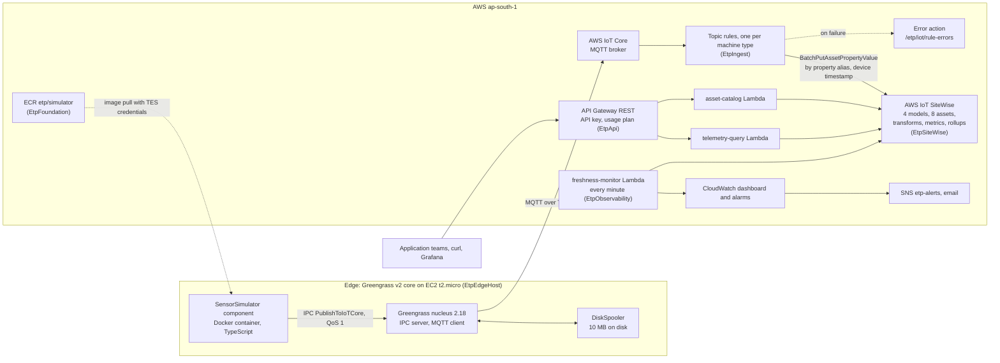
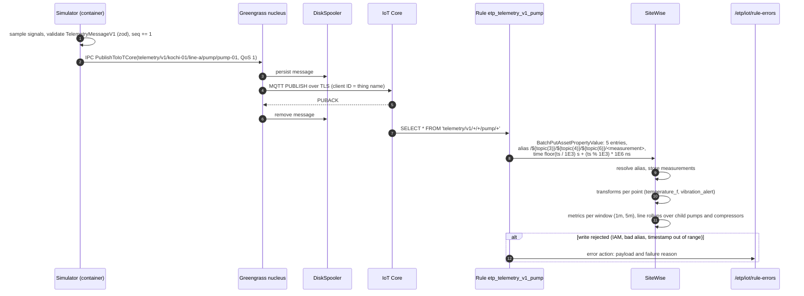
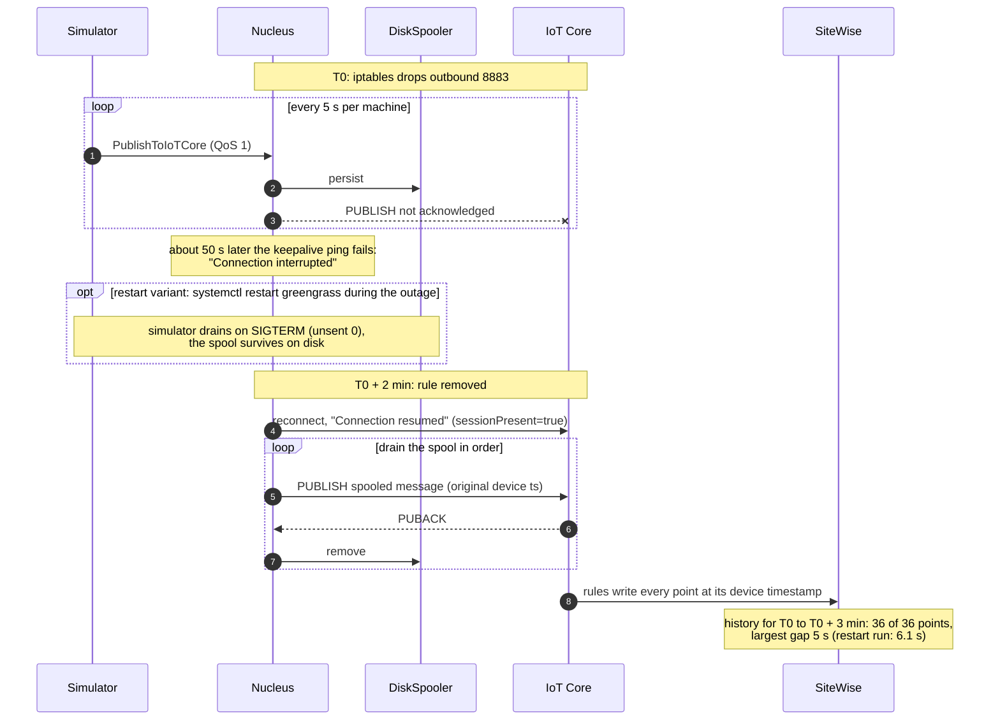
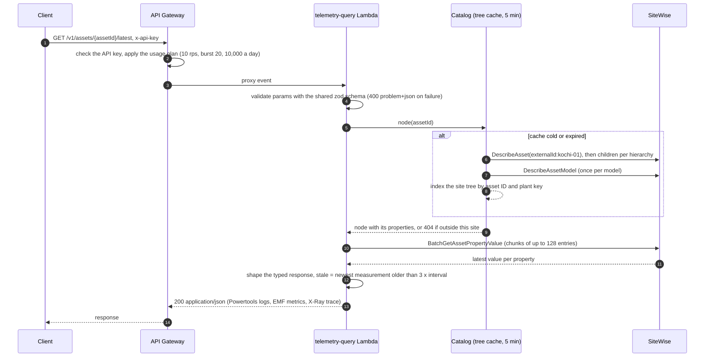
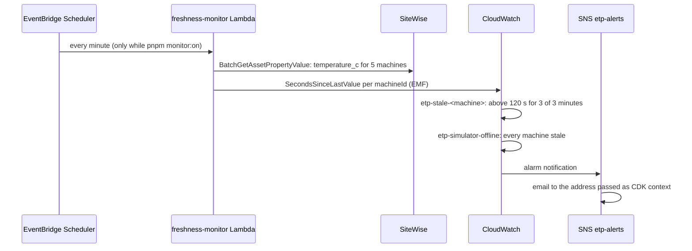

# Architecture

The platform has three planes. The **edge** produces telemetry and keeps it safe through outages. The **ingest and model** plane turns MQTT messages into an asset hierarchy with derived values. The **query** plane gives application teams a typed API over that hierarchy. One topology file in `packages/shared` drives all three (ADR 0001).

## Stacks

| Stack              | Contents                                                                                                     |
| ------------------ | ------------------------------------------------------------------------------------------------------------ |
| `EtpFoundation`    | ECR repository for the simulator image, SNS alerts topic, rule error log group                               |
| `EtpSiteWise`      | Asset models (site, line, pump, compressor) and the 8 assets, generated from the topology                    |
| `EtpIngest`        | One IoT topic rule per machine type, the rule role (alias-scoped), the error action                          |
| `EtpApi`           | REST API built from the shared route table, two Lambda services, API key and usage plan                      |
| `EtpObservability` | Freshness monitor and its schedule, 12 alarms, the `etp-overview` dashboard, the monthly budget              |
| `EtpEdge`          | Thing group, core IoT policy, token exchange role and alias, the simulator component, the deployment         |
| `EtpEdgeHost`      | VPC without NAT, a security group with no inbound rules, the t2.micro core host; only with `-c edgeHost=ec2` |

## Names derived from the topology

A machine `pump-01` on `line-a` at `kochi-01` gets every name from small functions in `packages/shared`:

| Use               | Value                                                | Built by                 |
| ----------------- | ---------------------------------------------------- | ------------------------ |
| MQTT topic        | `telemetry/v1/kochi-01/line-a/pump/pump-01`          | `topicFor()`             |
| Rule topic filter | `telemetry/v1/+/+/pump/+`                            | `topicFilterForType()`   |
| Property alias    | `/kochi-01/line-a/pump-01/temperature_c`             | `aliasFor()`             |
| Alias in the rule | `/${topic(3)}/${topic(4)}/${topic(6)}/temperature_c` | `ruleAliasTemplate()`    |
| Asset external ID | `kochi-01.line-a.pump-01`                            | `assetExternalIdFor()`   |
| API key lookup    | `GET /v1/assets/by-key/kochi-01/line-a/pump-01`      | route table `API_ROUTES` |

A unit test proves that the rule template and `aliasFor()` produce the same string for every measurement of every machine, so the cloud and the device agree without a deploy.

## Ingest: one sample from sensor to SiteWise

Every 5 seconds each simulated machine produces one message with 4 numeric measurements and a status, timestamped on the device.

Notes:

- The container has no certificate and no AWS credentials. The nucleus authenticates it over IPC with `SVCUID`, and the recipe's access control allows only `PublishToIoTCore` on `telemetry/v1/#` (ADR 0006).
- The rule role may write only to data streams whose alias starts with `/kochi-01/` and to the 5 machine assets by ARN (ADR 0012).
- A QoS 1 duplicate writes the same timestamp and value again, which SiteWise treats as the same point.

## Outage replay: zero loss across a network drop and a restart

`pnpm edge:outage-test` blocks outbound TCP 8883 on the core host for 2 minutes with iptables (SSM keeps working on 443) and then checks SiteWise history for gaps.

The outage window is bounded by two limits: SiteWise accepts timestamps up to 7 days old (ADR 0004), and the spool holds 10 MB. Messages are about 240 bytes, so at the default rate (3,600 messages an hour across 5 machines) the spool holds roughly 10 hours. The spool fills first, so the configured size, not SiteWise, is what limits the outage this build survives.

## Query: latest values through the API

Aggregates and history follow the same path with `GetAssetPropertyAggregates` and `GetAssetPropertyValueHistory`. The reader rounds query bounds to whole seconds, because SiteWise rejects dates with milliseconds. Measured p95 against live data: tree 59 ms (warm), latest 156 ms, aggregates over 24 hours at 1 minute 81 ms (`pnpm smoke`).

## Freshness monitoring

Measured end to end: with Greengrass stopped, the stale alarms fired 5 minutes 24 seconds later and the composite 8 seconds after that.

## Security boundaries

| Boundary             | Control                                                                                                                                                                                  |
| -------------------- | ---------------------------------------------------------------------------------------------------------------------------------------------------------------------------------------- |
| Device to IoT Core   | X.509 certificate; the core policy names its own thing: connect as that client ID, publish telemetry only under `telemetry/v1/`, plus its own Greengrass health, jobs, and shadow topics |
| Container to nucleus | IPC access control: `PublishToIoTCore` on `telemetry/v1/#` only                                                                                                                          |
| Device to AWS APIs   | Token exchange role via role alias: pull from the one ECR repository; no long-lived keys on the device                                                                                   |
| EC2 host             | No inbound rules, IMDSv2 only, SSM for shell access; instance role has 5 IoT actions and no IAM actions                                                                                  |
| Rule to SiteWise     | Write only to aliases under `/kochi-01/` and the 5 machine assets                                                                                                                        |
| API callers          | API key and usage plan; Lambda roles are read-only on SiteWise                                                                                                                           |
| Repository           | gitleaks scans the full history in CI; certificates live in `.certs/` (gitignored) or only on the device                                                                                 |
